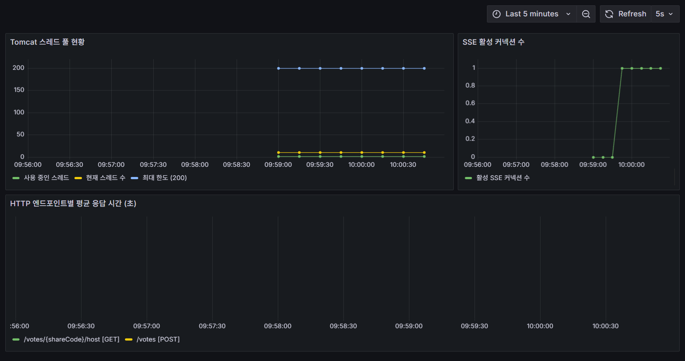
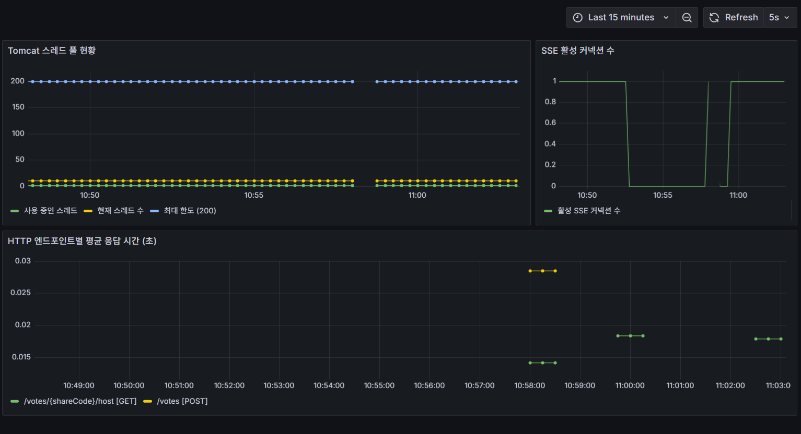
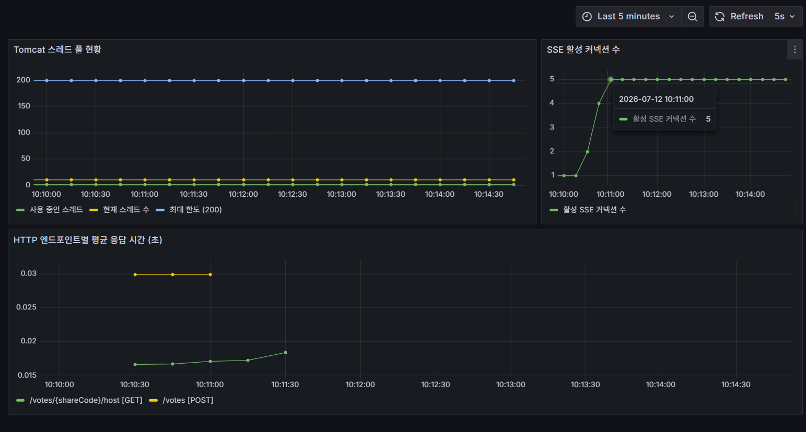
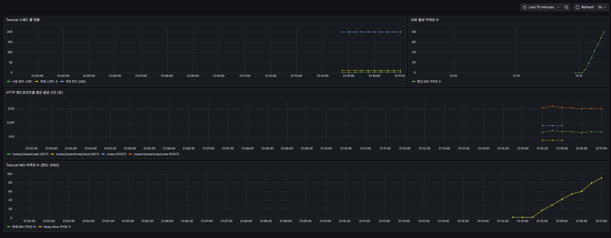
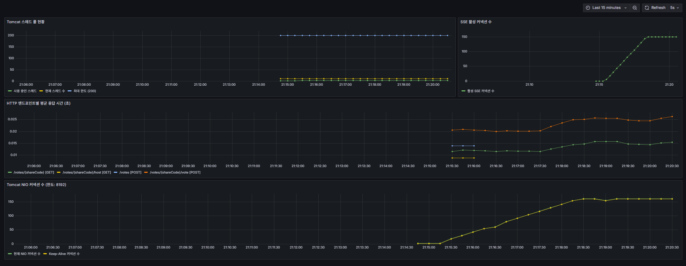
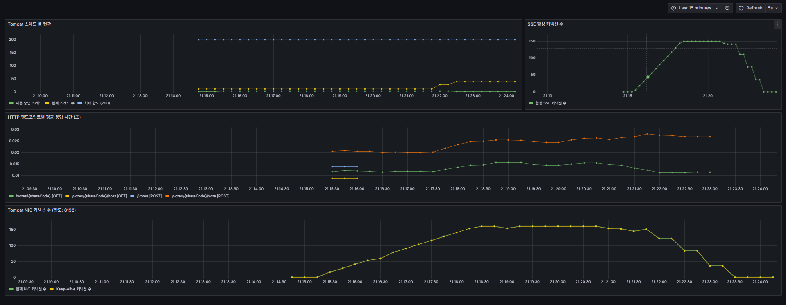
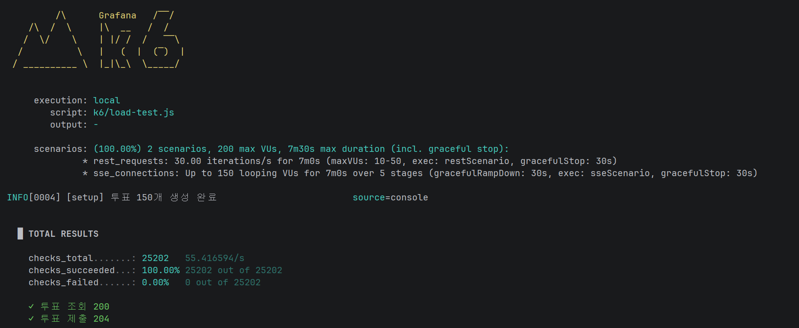
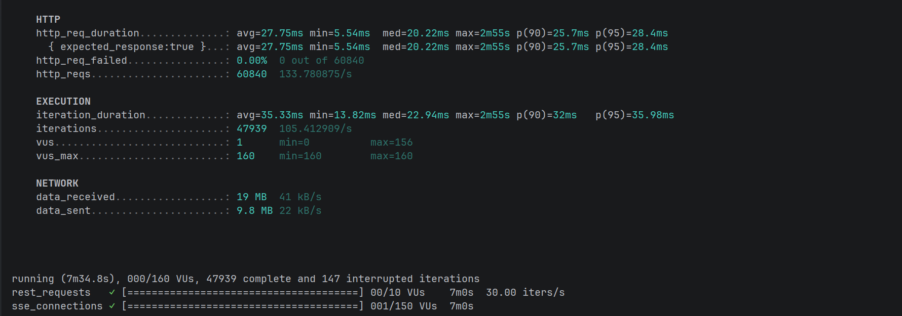

# 고성능 실시간 익명 투표 시스템

로그인 없이 URL 공유만으로 실시간 투표를 생성하고 결과를 확인할 수 있는 서비스입니다.
단순한 기능 구현보다 **아키텍처 진화 과정과 기술적 의사결정**에 집중한 백엔드 포트폴리오입니다.

---

## 기술 스택

| 영역 | 기술 |
|---|---|
| Backend | Java 21, Spring Boot 3.5, Spring MVC, JPA |
| Database | MySQL 8.4, Redis 8.0 |
| Frontend | React, Vite, Tailwind CSS |
| Infra | Docker, Docker Compose |
| Monitoring | Prometheus, Grafana, Micrometer |
| CI | GitHub Actions, Testcontainers |
| Load Test | k6 |

---

## 아키텍처 진화 로드맵

이 프로젝트는 아키텍처를 처음부터 완성된 형태로 설계하지 않고, **실측 실험과 비교를 통해 필요한 시점에 전환**하는 방식으로 진행했습니다.

```
Phase 0 (완료)                Phase 1 (완료)               Phase 2 (예정)
────────────────────          ──────────────────────────    ─────────────────────────
레이어드 아키텍처              헥사고날 아키텍처              vote-push 프로세스 분리
Controller-Service-Repo  →   Port / Adapter 분리        →  WebFlux(Netty) + Redis Pub/Sub
                              Rich Entity 도메인 메서드
```

### Phase 0 → Phase 1 전환 근거 (비교 실험)

VoteService가 `StringRedisTemplate`을 직접 의존하는 레이어드 구조와, `VoteCountPort` 인터페이스를 통해 Redis를 추상화한 헥사고날 구조 두 버전의 단위 테스트를 직접 작성해 비교했습니다.

| | 레이어드 | 헥사고날 |
|---|---|---|
| Mock 대상 | `StringRedisTemplate` + `ValueOperations` 체이닝 | `VoteCountPort` 인터페이스 1개 |
| Spring 내부 API 지식 | 필요 (opsForValue, setIfAbsent 체이닝) | 불필요 |
| stubbing 코드량 | 많음 | 단순 |

차이가 유의미하다고 판단해 Phase 1 적용을 확정했습니다. ([의사결정 기록](docs/decisions.md))

### Phase 2 전환 조건

부하 테스트 실험에서 SseEmitter가 Tomcat 스레드를 점유하지 않음이 확인되어 기존 조건("스레드 고갈 시")은 폐기했습니다. **실제 병목은 NIO 커넥션 수(max-connections 기본 8192)** 이며, 운영 환경에서 SSE 커넥션이 서비스 가용성에 영향을 주는 규모로 증가하는 시점에 진행할 예정입니다.

---

## 핵심 기술 선택

### 1. SSE(Server-Sent Events) — Host 전용 단방향 실시간 통신

**왜 WebSocket이 아닌 SSE인가?**

Host(투표 생성자)는 집계 결과를 **받기만** 하면 되므로 양방향 통신이 필요하지 않습니다. 참여자는 REST 1회성 요청으로만 투표를 제출하므로 SSE 연결 대상에서 제외했습니다. 이 구조로 SSE 커넥션 수를 "동시 참여자 수"가 아닌 "현재 열린 투표 수"로 제한했습니다.

**SseEmitter 동작 원리 (스레드 비점유)**

```
요청 수신 → Tomcat 스레드가 처리 시작
    ↓
request.startAsync() 호출 (Servlet 3.1 AsyncContext)
    ↓
Tomcat 스레드 즉시 반환 ← 핵심
    ↓
NIO Selector가 커넥션을 관리 (스레드 없이 이벤트 감지)
    ↓
새 데이터 발생 시에만 스레드를 잠깐 빌려 send() 실행
```

**이벤트 전파 흐름**

```
castVote() → DB INSERT + Redis INCR → publishEvent(VoteCastEvent)
    → 트랜잭션 커밋 → @TransactionalEventListener(AFTER_COMMIT)
    → SseEmitterManager.broadcast() → Host 화면 실시간 갱신
```

`@TransactionalEventListener(AFTER_COMMIT)`을 사용한 이유는 두 가지입니다.

- **정합성**: `@EventListener`(기본값)는 트랜잭션 안에서 실행됩니다. 커밋 전에 SSE 이벤트가 나가면 Host 화면이 즉시 `GET /votes/{shareCode}`를 호출하는데, DB에는 아직 미커밋 상태라 이전 집계가 반환됩니다.
- **트랜잭션 오염**: SSE `send()` 도중 `IOException`이 발생하면 같은 트랜잭션 안이므로 DB INSERT(투표 기록)까지 롤백될 수 있습니다. `AFTER_COMMIT`은 트랜잭션 종료 후 실행되므로 SSE 오류가 DB에 영향을 주지 않습니다.

### 2. Redis + DB 이중화 집계 구조 (Write-Through)

```
참여자 투표 제출
    ├── Redis SETNX → 중복 투표 1차 방어 (빠른 응답)
    ├── VoteRecord DB INSERT → 영속성 보장 (2차 방어 UNIQUE 제약)
    └── Redis INCR → 실시간 집계 카운터

결과 조회
    ├── Redis 정상 → vote:count:{pollId}:{optionId} 직접 반환
    └── Redis 장애 → DB GROUP BY COUNT(*) 폴백
```

VoteOption에 count 컬럼을 두지 않아 동시 UPDATE 경합을 구조적으로 방지했습니다.

### 3. 헥사고날 아키텍처 — 절충형 적용

완전한 헥사고날(adapter/in/web/ 전체 이동)은 적용 비용 대비 실익이 없다고 판단해, **테스트 복잡도가 실제로 줄어드는 Redis 레이어에만** 포트/어댑터를 적용했습니다.

```
VoteService
    ├── DuplicateVoteCheckPort (interface)
    │       └── RedisDuplicateVoteCheckAdapter (구현체)
    ├── VoteCountPort (interface)
    │       └── RedisVoteCountAdapter (구현체)
    └── VoteCountReadPort (interface)
            └── VoteCountReadAdapter (구현체)
```

### 4. Rate Limiting — Bucket4j 토큰 버킷

무한 새로고침·투표 조작 방지를 위해 주요 엔드포인트에 제한을 적용했습니다.

| 엔드포인트 | 제한 |
|---|---|
| `GET /votes/{shareCode}` | 분당 30회 |
| `POST /polls` | 분당 5회 |
| `POST /votes/{shareCode}/vote` | 분당 5회 |

- **키**: 클라이언트 IP
- **알고리즘**: refillGreedy (초당 균등 충전)
  - `refillIntervally`는 1분 윈도우가 끝날 때 토큰을 한꺼번에 충전합니다. 0:59에 30개, 1:01에 30개를 쓰면 2초 안에 60회 요청이 가능한 문제가 생깁니다.
  - `refillGreedy`는 초당 균등 충전합니다. 30개를 쓰려면 반드시 60초가 필요하므로 어느 구간에서도 순간 폭발이 불가능합니다.
- **저장소**: LettuceBasedProxyManager (기존 Redis 클라이언트 재사용)
- **적용 방식**: `@RateLimit` 커스텀 애노테이션 + AOP

**왜 쿠키(participantToken) 기반에서 IP 기반으로 전환했는가?**

초기 설계는 쿠키에 저장된 `participantToken`을 Rate Limiting 키로 사용했습니다. 그러나 쿠키를 삭제하고 새로고침하면 새 토큰이 발급되어 제한이 즉시 초기화되는 치명적 허점이 있었습니다. IP는 클라이언트가 임의로 변경할 수 없어 더 강한 식별 기준입니다.

**X-Forwarded-For 처리**

Nginx는 `proxy_set_header X-Forwarded-For $remote_addr`으로 클라이언트가 보낸 기존 헤더를 덮어씁니다. 위조된 헤더가 Spring까지 전달되지 않으므로 첫 번째 값이 곧 진짜 클라이언트 IP입니다.

```java
String forwarded = request.getHeader("X-Forwarded-For");
if (forwarded != null && !forwarded.isBlank()) {
    return forwarded.split(",")[0].trim();
}
return request.getRemoteAddr(); // 로컬 개발 환경 폴백
```

### 5. Poll 생명주기 관리 — 활성 기간과 보관 기간의 분리

투표에는 두 개의 별개 시간 개념이 존재합니다.

| 개념 | 필드 | 결정 주체 | 최대 |
|---|---|---|---|
| 활성 기간 | `expiresAt` | 생성자 설정 | 7일 |
| 보관 기간 | — | 비즈니스 규칙 | 종료 후 30일 |

두 개념을 분리한 이유는 목적이 다르기 때문입니다. "언제까지 투표를 받을 것인가"는 생성자의 선택이고, "데이터를 얼마나 보관할 것인가"는 운영 정책입니다. 같은 기간으로 묶으면 7일 후 투표와 결과가 동시에 사라지는 비직관적 UX가 됩니다.

**closedAt이 필요한 이유**

생성자가 수동 종료하면 `expiresAt` 이전에 투표가 끝납니다. 보관 기간은 실제로 닫힌 시점부터 계산해야 하므로 `closedAt` 컬럼을 별도로 추가했습니다.

```java
// 수동 종료는 closedAt, 자연 만료는 expiresAt 기준으로 통합
@Query("SELECT p FROM Poll p WHERE COALESCE(p.closedAt, p.expiresAt) < :threshold")
List<Poll> findAllClosedBefore(@Param("threshold") LocalDateTime threshold);
```

**삭제 순서 (외래키 제약 준수)**

```
VoteRecord 삭제 → VoteOption 삭제 → Poll 삭제 → Redis 키 삭제
```

Redis 키는 DB 삭제 후 정리합니다. 순서가 뒤집히면 Redis 조회 실패와 DB 부재가 겹쳐 집계 폴백도 불가능해집니다.

---

## 트러블슈팅

### 1. SSE 생명주기 — 3가지 버그와 해결

브라우저 수동 테스트에서 연달아 발견한 3가지 버그를 해결했습니다.

#### 버그 ① 좀비 연결 — 탭을 닫아도 emitter가 Map에 잔류

**원인**: SseEmitter는 `send()` 호출 시 IOException이 발생해야만 연결 끊김을 감지합니다. 브라우저가 TCP FIN을 보내도 서버가 아무것도 보내지 않는 상태에서는 연결이 끊겼는지 알 수 없습니다.

| 버그 | 수정 후 |
|---|---|
|  |  |

**해결**: 30초 Heartbeat(`@Scheduled`)로 주기적으로 `comment("ping")`을 전송. 죽은 연결에서 IOException 발생 → `onError` 콜백 → Map에서 제거.

```java
@Scheduled(fixedDelay = 30_000)
public void sendHeartbeat() {
    emitters.forEach((pollId, emitter) -> {
        try {
            emitter.send(SseEmitter.event().comment("ping"));
        } catch (IOException e) {
            remove(pollId, emitter);
        }
    });
}
```

#### 버그 ② 다중 탭 누적 — 같은 투표를 여러 탭으로 열면 연결이 계속 쌓임

**원인**: 기존 `CopyOnWriteArrayList` 구조에서 새 탭 접속 시 emitter가 추가만 되고 기존 것이 제거되지 않음.



**해결**: `Map<Long, SseEmitter>` 교체 방식으로 변경. `ConcurrentHashMap.compute()`로 새 emitter 등록과 기존 emitter 종료를 원자적으로 처리.

```java
emitters.compute(pollId, (k, existing) -> {
    if (existing != null) {
        existing.send(SseEmitter.event().name("close").data("replaced"));
        existing.complete();
    }
    return emitter; // 새 emitter로 교체
});
```

`compute()`를 선택한 이유: `ConcurrentHashMap`은 `compute()` 실행 중 해당 키에 대한 락을 유지합니다. "기존 emitter 조회 → 종료 → 새 emitter 저장"이 하나의 원자적 단위로 처리되므로, 두 탭이 동시에 접속해도 emitter가 중복 등록되거나 잘못 삭제되는 경쟁 조건이 발생하지 않습니다.

#### 버그 ③ 핑퐁 재연결 — `complete()` 호출 시 브라우저가 자동 재연결

**원인**: 브라우저 `EventSource`는 서버가 연결을 끊으면 자동으로 재연결을 시도합니다. 교체된 구 탭이 재연결 → 다시 교체 → 무한 루프.

**해결**: 서버에서 `close` named 이벤트를 먼저 전송하고, 프론트에서 `eventSource.close()`를 직접 호출해 자동 재연결을 차단.

```javascript
// onmessage는 name 없는 기본 이벤트만 수신하므로 addEventListener 필요
eventSource.addEventListener('close', () => {
  setConnected(false)
  eventSource.close() // 브라우저 자동 재연결 방지
})
```

---

### 2. Rate Limiting CI 실패 — `@ServiceConnection`과 별도 `RedisClient` 충돌

**증상**: 로컬에서는 정상 동작하지만 GitHub Actions CI에서만 Redis 연결 실패.

```
ConnectionRefusedException: Unable to connect to localhost:6379
```

**원인**: `@ServiceConnection`은 `LettuceConnectionFactory`의 포트만 컨테이너 포트로 교체합니다. `RateLimitConfig`가 `RedisProperties`를 직접 읽어 별도 `RedisClient` 빈을 생성하고 있어서, 이 클라이언트는 여전히 `application.yaml`의 6379를 바라봤습니다.

```
LettuceConnectionFactory  →  port: 49231  ← @ServiceConnection이 교체
RedisClient (별도 빈)     →  port: 6379   ← yaml 값 그대로, 컨테이너 없음 → 실패
```

**해결**: 별도 빈 생성을 제거하고, `@ServiceConnection`이 이미 올바른 포트로 설정한 `LettuceConnectionFactory`에서 내부 클라이언트를 꺼내 재사용.

```java
RedisClient redisClient = (RedisClient) lettuceConnectionFactory.getRequiredNativeClient();
StatefulRedisConnection<byte[], byte[]> nativeConnection = redisClient.connect(ByteArrayCodec.INSTANCE);
```

---

## 부하 테스트 결과 (Phase 0 실험)

**시나리오**: SSE 150개 ramping(0→50→100→150, 3분) + peak 유지(2분) + ramp-down(150→0, 2분) + REST 30 req/s 고정(7분 병렬)

**목적**: "SSE 커넥션 증가 → Tomcat 스레드 고갈 → REST 응답 지연" 가설 검증 및 종료 시 스레드 스파이크 원인 규명(대조 실험)

### Tomcat 스레드 — SSE 150개에서도 ≈0 유지

| 램프업 구간 (SSE 0→150) | 피크 구간 (SSE 150 유지) |
|---|---|
|  |  |

**전체 타임라인 (ramp-up → peak → ramp-down)**



**결론**: SseEmitter는 Servlet 3.1 AsyncContext/NIO 처리로 Tomcat 스레드를 즉시 반환합니다. SSE 150개 연결 상태에서도 사용 중인 스레드(초록선) ≈0, 기존 가설은 **폐기**.

#### 대조 실험 — ramp-down 시 스레드 스파이크 원인 규명

초기 실험(ramp-down 없는 버전)에서 테스트 종료 직전 현재 스레드 수가 ~75까지 순간 상승하는 현상이 관찰됐습니다. 원인을 규명하기 위해 ramp-down 구간을 추가해 SSE 연결이 점진적으로 끊히는 대조 실험을 진행했습니다.

| 조건 | 현재 스레드 수 최대값 | 사용 중인 스레드 |
|---|---|---|
| 150개 동시 종료 (초기 실험) | ~75 (순간 스파이크) | 0 유지 |
| 점진적 ramp-down (대조 실험) | ~30~40 (분산, 소폭) | 0 유지 |

점진적 종료 시 스파이크가 절반 수준으로 줄고 분산 발생 → **초기 실험 스파이크는 150개 연결이 동시 종료되면서 `onCompletion` 콜백이 한꺼번에 실행된 테스트 아티팩트로 확정**. 현재 스레드 수 소폭 상승은 Tomcat이 연결 종료 콜백 처리를 위해 스레드 풀을 잠깐 조정한 것이며, 실제 요청을 처리한 스레드(사용 중인 스레드)는 어떤 구간에서도 영향을 받지 않았습니다.

### k6 결과 — 60,840건 전량 성공, p95 = 28.4ms

| checks 100% 성공 | 응답시간 상세 |
|---|---|
|  |  |

| 지표 | 값 | 설명 |
|---|---|---|
| http_req_failed | **0.00%** (60,840건) | 에러 없음 |
| p(90) | **25.7ms** | 전체 요청의 90%가 이 시간 이하로 응답 |
| p(95) | **28.4ms** | 전체 요청의 95%가 이 시간 이하로 응답 |
| max | 2m55s | sseScenario의 `http.get()`이 SSE 연결을 유지한 시간이 포함된 값 — 평균(avg)을 왜곡하므로 지표로 사용하지 않음 |

> **왜 avg 대신 p90/p95인가?** k6는 SSE 연결(`http.get()` 블로킹)도 하나의 HTTP 요청으로 측정합니다. ramp-down 시 강제 종료된 SSE 연결의 유지 시간(최대 약 3분)이 평균을 크게 끌어올려 실제 REST 응답시간을 반영하지 못합니다. p95는 "100명 중 95명이 경험하는 응답시간"으로, 실제 사용자 경험에 가장 가까운 지표입니다.

SSE 0개 → 150개 → 0개 전 구간에서 REST 응답시간 변화 없음.

---

## 로컬 실행

### 사전 요구사항
- Docker Desktop, Java 21, Node.js

### 1. 환경 변수 설정

```bash
cp .env.example .env
# .env 파일에 DB 접속 정보 입력
```

### 2. 인프라 실행

```bash
docker-compose up -d
```

### 3. 백엔드 실행

```bash
./gradlew bootRun --args='--spring.profiles.active=local'
```

### 4. 프론트엔드 실행

```bash
cd frontend
npm install
npm run dev
```

### 5. 모니터링

| 서비스 | URL |
|---|---|
| 애플리케이션 | http://localhost:5173 |
| Grafana | http://localhost:3000 |
| Prometheus | http://localhost:9090 |

### 모니터링 초기화 (데이터 리셋 시)

```bash
docker-compose down
docker volume rm vote_prometheus-data vote_grafana-data
docker-compose up -d
```

---

## 의사결정 기록

모든 기술 선택의 배경, 대안, 트레이드오프는 [`docs/decisions.md`](docs/decisions.md)에 기록되어 있습니다.
